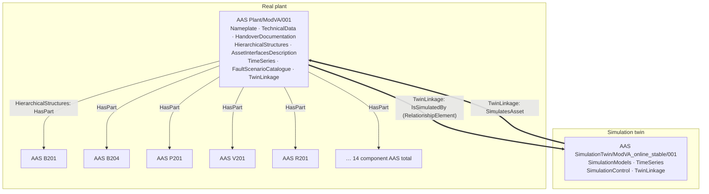
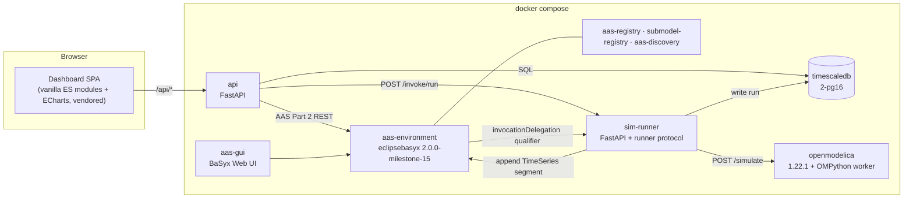

# AAS Design — ModVA Fluid Mixing Plant Digital Twin

**Status:** Phase 2 deliverable, awaiting review.
**Scope:** Maps the fluid mixing benchmark onto Asset Administration Shell concepts
(IEC 63278-1 / AAS metamodel V3), fixes the submodel set, the semanticId strategy, the
real↔simulation linkage, the runtime architecture and the technology choices.

Every design decision below cites the benchmark file or section that informed it. Source repository:
[`MalteRamonat/fluid-mixing-anomaly-benchmark`](https://github.com/MalteRamonat/fluid-mixing-anomaly-benchmark)
(`main`), hereafter **[BM]**. Paper: Ramonat, Zimmering, Merkelbach, Gehlhoff, Niggemann, Fay,
*A Fluid Mixing Benchmark for Anomaly Detection in CPS with Real & Simulated Data*,
IEEE Access 2025, DOI [10.1109/ACCESS.2025.3592815](https://doi.org/10.1109/ACCESS.2025.3592815).

---

## 1. What is being modelled

| Concept | Realisation |
| --- | --- |
| The physical plant | One Instance AAS + 14 component Instance AASs |
| The Modelica model of the plant | One Instance AAS, linked to the plant AAS by a `RelationshipElement` |
| 55 recorded runs (real sensor data) | IDTA Time Series Data submodel on the plant AAS, one segment per run |
| Simulated runs | IDTA Time Series Data submodel on the simulation AAS, one segment per run |
| Fault scenarios and their labels | Custom `FaultScenarioCatalogue` submodel |
| The real↔sim signal correspondence | Custom `TwinLinkage` submodel (annotated relationships) |
| Executing a simulation | Custom `SimulationControl` submodel with AAS `Operation`s |

The plant's process topology — every vessel, valve, pump, instrument and external connection,
reconstructed from the P&ID, the Modelica `connect(...)` graph and the recorded data, and
cross-checked between all three — is documented separately in
[`docs/plant-topology.md`](../docs/plant-topology.md). This design assumes that topology.

**Non-goals for this project:** re-implementing the anomaly-detection framework in `[BM]/src`,
live OPC UA connectivity to the physical plant (the AAS *describes* the interface; it does not
poll it), and closed-loop control of the Modelica model.

---

## 2. Identifier and semanticId strategy

### 2.1 Identifier scheme

All identifiers are IRIs under a single project namespace so they are globally unique, resolvable
in principle, and obviously project-owned:

```
Base                https://ramonat.dev/modva/
Asset (global)      https://ramonat.dev/modva/asset/<Kind>/<Tag>/<Instance>
AAS                 https://ramonat.dev/modva/aas/<Kind>/<Tag>/<Instance>
Submodel            https://ramonat.dev/modva/sm/<Tag>/<SubmodelIdShort>/<Instance>
Custom semanticId   https://ramonat.dev/modva/idta-ext/<Submodel>/<Element>/1/0
ConceptDescription  https://ramonat.dev/modva/cd/<Element>/1/0
```

Examples:

```
https://ramonat.dev/modva/aas/Plant/ModVA/001
https://ramonat.dev/modva/aas/SimulationTwin/ModVA_online_stable/001
https://ramonat.dev/modva/aas/Component/B204/001
https://ramonat.dev/modva/sm/ModVA/TimeSeries/001
https://ramonat.dev/modva/idta-ext/FaultScenarioCatalogue/InductionMethod/1/0
```

`ModVA` is the plant designation used throughout `[BM]` (`data/ModVA_Datasets/`,
`ModVA_online_stable.mo`). Component tags (`B201`…`V209`, `P201`, `R201`) are the plant's own tags
from `[BM]/simulation/simulation_scripts/Simulation_Variable_Mapping.xlsx`, so the AAS identifiers
stay traceable to the P&ID.

> Open item O7 (resolved: no existing scheme). The base is a single constant in
> `src/aas_fluid_twin/aas/ids.py` and can be swapped without touching any builder.

### 2.2 semanticId rules

1. **Prefer an official IDTA template semanticId** wherever the template covers the element. All
   template semanticIds are taken verbatim from the JSON templates published in
   [`admin-shell-io/submodel-templates`](https://github.com/admin-shell-io/submodel-templates) —
   never typed from a PDF, never guessed. `scripts/vendor_idta_templates.py` distils each
   template JSON into a small index (idShort path → model type, semanticId, cardinality) under
   `src/aas_fluid_twin/resources/idta/`. The builders *read* semanticIds from these indexes, and
   the conformance test checks every emitted element against the same indexes — so a hand-typed
   IRI cannot exist, let alone drift.
2. **Prefer an ECLASS / IEC CDD IRDI** for physical quantities on component properties
   (pressure, volume flow, temperature, level, volume, nominal diameter).
3. **Only then** mint a custom IRI under `…/idta-ext/…`. Every custom IRI gets a
   `ConceptDescription` with an IEC 61360 `DataSpecificationIec61360` embedded data specification
   carrying `preferredName`, `shortName`, `definition`, `dataType` and `unit`. A custom
   semanticId without a ConceptDescription is a test failure.

This keeps the custom parts as machine-interpretable as the standardised parts, which is the whole
argument for using AAS rather than an ad-hoc JSON schema.

---

## 3. Shell topology

16 Asset Administration Shells, all `assetKind = Instance` (the plant exists; it is not a catalogue
entry).



**Component AASs (14):** `B201`, `B202`, `B203`, `B204`, `P201`, `P202`, `V201`, `V202`, `V203`,
`V204`, `V205`, `V206`, `V209`, `R201`.

Rationale for this cut — **a shell is minted for every item the PLC can command or read**;
everything else is a BoM `Entity` node without its own shell:

| Item | Shell? | Why |
| --- | --- | --- |
| B201–B204, P201, P202, V201–V206, V209, R201 | **yes** | Each has an OPC UA node in the signal dictionary and its own datasheet |
| V207, V208, V210, V211, V212 | no — BoM `Entity` (`CoManagedEntity`) | Manual valves; no OPC UA node, no independent identity to carry. V210, V211 and V212 are still referenced by name from `FaultScenarioCatalogue`, which a `ReferenceElement` can do against a BoM entity just as well as against a shell |
| Sensors LI / PI / TI / FI / LA | no | Modelled as `PropertyAffordance`s in `AssetInterfacesDescription` and as `Node` entities in the BoM. Their type data lives in the plant `TechnicalData`, so per-sensor shells would duplicate rather than add |
| Pipes, Tee fittings, X201–X203 | no | No sensor, no actuator; represented as `TechnicalData` on the plant AAS |

Component shells carry:

| Submodel | Content | Source |
| --- | --- | --- |
| `Nameplate` | `ManufacturerName`, `ManufacturerProductDesignation`, `ManufacturerProductType` / `OrderCodeOfManufacturer` where the datasheet gives one, and `UniqueFacilityIdentifier` = the plant tag | `[BM]/documents/Process_Equipment/**` |
| `TechnicalData` | Tanks: `CrossSectionalArea`, `Height`, `NominalVolume`, `PortDiameter`. Pumps: `NominalSpeed`, the six head/flow characteristic points. Valves: `NominalPressureDrop`, `NominalMassFlow` and the datasheet's own ratings | `ModVA_online_stable.mo` + datasheets |

Identification recovered from the datasheets (they render and extract cleanly; only the P&ID
is outlined vector text, and that page rasterises legibly):

| Tag | `ManufacturerName` | `ManufacturerProductDesignation` / type |
| --- | --- | --- |
| V201–V203 | Festo | Gate valves, pneumatic, piloted by `NVF3-MOH-5/2K-1/4-EX` NAMUR solenoid |
| V204–V206 | Festo | `VZQA-C-M22U` pinch valve |
| V209 | Bürkert | Type `6013`, 2/2-way direct-acting solenoid |
| P201, P202 | — | Magnetic-drive seal-less circulating pump, `CM10P7-1` / `CM30P7-1` family |
| LI211–LI214 | Pepperl+Fuchs | `UC1000-18GS-IUEP-IO-V15` ultrasonic, IO-Link |
| PI251–PI254 | BD Sensors | `26.600 G`, ceramic OEM transmitter, **0…1 bar**, 0.5 % FSO |
| TI261, TI262 | ifm electronic | `TM4411` / `TM-050KFBR12-/US/`, Pt100 class A |
| FI271, FI272 | ifm electronic | `SM6000`, order code `SMR12GGXFRKG/US-100` |
| PLC | WAGO | `750-8212 PFC200 G2 2ETH RS` |

Absent is still better than invented: fields the datasheets do not give (serial numbers,
dates of manufacture) stay absent.

---

## 4. Submodels based on official IDTA templates

All template references verified against `admin-shell-io/submodel-templates@main`. Where a
`_forAASMetamodelV3.1` variant is published, that variant is used, because `basyx-python-sdk` 2.1.0
implements AAS metamodel V3.1.2.

| # | Submodel | Template | Submodel semanticId |
| --- | --- | --- | --- |
| 1 | `Nameplate` | Digital Nameplate 3.0 (IDTA 02006-3-0) | `https://admin-shell.io/idta/nameplate/3/0/Nameplate` |
| 2 | `TechnicalData` | Generic Technical Data 2.0 (IDTA 02003-2-0) | `0173-1#01-AHX837#002` |
| 3 | `HandoverDocumentation` | Handover Documentation 2.0 (IDTA 02004-2-0) | `0173-1#01-AHF578#003` |
| 4 | `HierarchicalStructures` | Hierarchical Structures enabling BoM 1.1 (IDTA 02011-1-1) | `https://admin-shell.io/idta/HierarchicalStructures/1/1/Submodel` |
| 5 | `AssetInterfacesDescription` | Asset Interfaces Description 1.1 (IDTA 02017-1-1) | `https://admin-shell.io/idta/AssetInterfacesDescription/1/1/Submodel` |
| 6 | `TimeSeries` | Time Series Data 1.1 (IDTA 02008-1-1) | `https://admin-shell.io/idta/TimeSeries/1/1` |
| 7 | `SimulationModels` | Provision of Simulation Models 1.1 (IDTA 02005-1-1) | `https://admin-shell.io/idta/SubmodelTemplate/SimulationModels/1/1` |

### 4.1 `Nameplate` (plant AAS)

`ManufacturerProductDesignation` = "ModVA Fluid Mixing Plant (Mischmodul)";
`UniqueFacilityIdentifier` = `ModVA`. The only component with verifiable identification today is
the controller, a **WAGO 750-8212 PFC200 G2 2ETH RS** — derived from every OPC UA NodeId in the
mapping table, which is prefixed
`ns=4;s=|var|WAGO 750-8212 PFC200 G2 2ETH RS.Application.…`. It becomes an
`AssetSpecificProperties` entry rather than the plant's own manufacturer.

### 4.2 `TechnicalData` (plant AAS)

`TechnicalPropertyAreas` grouped as:

- **Vessels** — B201/B202/B203: `crossArea = 0.01431355 m²`, `height = 0.22 m` ⇒ nominal volume
  ≈ 3.15 L; B204: `crossArea = 0.0324 m²`, `height = 0.35 m` ⇒ ≈ 11.34 L. Outlet port
  ⌀ 0.011 m. *(Source: `ModVA_online_stable.mo`, `TankWithTopPorts` declarations.)*
- **Pumps** — `N_nominal = 166.43`, displaced volume `V = 4.398128e-5 m³`, quadratic flow
  characteristic through three (V̇, head) points: `(1.22e-4, 2.045)`, `(2.0e-4, 1.534)`,
  `(2.5e-4, 1.022)` for both P201 and P202. *(Source: `ModVA_online_stable.mo` parameter block.)*
- **Valves** — `ValveLinear`, `dp_nominal = 20 Pa`, `m_flow_nominal = 0.1 kg/s`
  (V207: `dp_nominal = 2000 Pa`). *(Source: same.)*
- **Piping** — ⌀ 0.01 m; segment lengths 0.05 – 0.57 m, enumerated per segment.
  Physical fittings are John Guest Speedfit push-fit (from the datasheet filenames in
  `[BM]/documents/Process_Equipment/Piping/`).
- **Medium** — water, `Modelica.Media.Water.StandardWaterOnePhase`.

- **Instrument spans** — from the datasheets, now recovered:

  | Tag | Measuring span | Accuracy |
  | --- | --- | --- |
  | PI251–PI254 | 0…1 bar relative | ≤ ±0.5 % FSO (IEC 60770) |
  | TI261, TI262 | −40…150 °C | ±(0.15 K + 0.002·\|t\|), Pt100 class A |
  | FI271, FI272 | 0.1…25 l/min (0.005…1.5 m³/h) | per ifm SM6000 |
  | LI211–LI214 | 70…1000 mm detection, 90…1000 mm settable, **0…70 mm blind zone** | ultrasonic |

  The ultrasonic blind zone is worth carrying explicitly: it is a measurement limit of the
  channel the whole plant depends on, and it is not derivable from the data.

### 4.3 `HandoverDocumentation` (plant AAS)

One `Document` per artefact in `[BM]/documents/`, following the VDI 2770 structure the template
prescribes (`DocumentId`, `DocumentClassification` per VDI 2770 class, `DocumentVersion` with
`DigitalFile`, `Title`, `Language`):

| Document | VDI 2770 class | File |
| --- | --- | --- |
| P&ID | 02-01 Technical specification | `PID-Diagram.pdf` |
| PLC program (SFC) | 03-01 Assembly/installation | `Application.Anlagensteuerung.xml` |
| Controller manuals (2) | 04-01 Operation | `d0750xxxx-…pdf`, `m075xxxxx-…pdf` |
| Pump datasheet | 02-01 | `P201 + P202 Pumps.pdf` |
| Sensor datasheets (4) | 02-01 | `Flow_/Level_/Pressure_/Temperature_Sensor.pdf` |
| Valve datasheets (3) | 02-01 | `V201_V202_V203.PDF`, `V204_V205_V206.pdf`, `V209.pdf` |
| Piping datasheets (6) | 02-01 | John Guest Speedfit sheets |
| Benchmark paper | 01-01 Identification | DOI reference (`ExternalDocument`) |

Files are uploaded to the BaSyx repository through the attachment endpoint so the `DigitalFile`
`value` resolves inside the server rather than pointing at a local path.

### 4.4 `HierarchicalStructures` (plant AAS) — the BoM

`ArcheType = "OneDown"` (the plant knows its direct children; each child AAS is a first-class
shell, not a nested copy).

```
HierarchicalStructures
├── ArcheType = "OneDown"
└── EntryNode  [Entity]  globalAssetId = …/asset/Plant/ModVA/001
    ├── Node "DosingSection"
    │   ├── Node B201 ─ globalAssetId …/asset/Component/B201/001
    │   │   └── HasPart → LI211, PI251, LA201, LA210   (sensor nodes, no own AAS)
    │   ├── Node B202 …, Node B203 …
    │   ├── Node V201, V202, V203   (tank outlet valves)
    │   ├── Node V204, V205, V206   (tank inlet valves)
    │   └── Node P201               (dosing pump) ─ HasPart → FI271, TI261
    ├── Node "MixingSection"
    │   ├── Node B204 ─ HasPart → LI214, PI254, TI262, LA204, LA205, LA240
    │   ├── Node R201  (stirrer)
    │   └── Node P202  ─ HasPart → FI272
    ├── Node "DischargeSection"
    │   └── Node V209
    └── Node "Control"
        └── Node PLC_WAGO_750-8212
```

Each `Node` uses `HasPart` / `IsPartOf` `RelationshipElement`s as the template prescribes.
Component nodes carry `globalAssetId` pointing at their own AAS's asset; sensor nodes are
`Entity` with `entityType = SelfManagedEntity` only where they have an asset id, otherwise
`CoManagedEntity`.

Section grouping follows the process flow visible in the Modelica topology
(`tank_B20{1,2,3}` → `V20{1,2,3}` → Tee1/Tee2 → `P201` → `FI271` → `tank_B204` → `V207` →
`P202` → Tee6 → `V209` → boundary) and the PLC step families
(`Tank_b20x_leeren` / `Mischer_Ruehren` / `Tank_b20x_fuellen` / `Entleeren`).

### 4.5 `AssetInterfacesDescription` (plant AAS) — the OPC UA interface

This is where the 47-row signal dictionary lands, and it is the reason AID was chosen over a
hand-rolled "SensorList" submodel: AID is a W3C WoT Thing Description expressed in AAS, and the
benchmark already stores exactly the information WoT needs — an endpoint, a node id per signal,
a data type, and a unit.

```
AssetInterfacesDescription
└── InterfaceOPCUA  [SMC, semanticId …/AssetInterfacesDescription/1/0/Interface]
    ├── title = "ModVA PLC OPC UA Server"
    ├── EndpointMetadata
    │   ├── base = "opc.tcp://<plc-host>:4840"          ← open item O8 (host/port)
    │   ├── contentType = "application/x.opcua-binary"
    │   └── securityDefinitions/nosec_sc
    ├── InteractionMetadata
    │   └── properties
    │       ├── Tank_B201_Volume  [SMC, …/PropertyDefinition]
    │       │   ├── key   = "Tank_B201_Volume"          ← CSV column name (verbatim)
    │       │   ├── type  = "number"
    │       │   ├── title = "Tank B201 filling volume"
    │       │   ├── unit  = "ml"                        ← Unit_Sensor
    │       │   ├── observable = true
    │       │   ├── valueSemantics → ConceptDescription (ECLASS volume IRDI)
    │       │   └── forms
    │       │       └── href = "ns=4;s=|var|WAGO 750-8212 PFC200 G2 2ETH RS.
    │       │                   Application.Umrechnung_Analogsensorik.VolumeB201"
    │       ├── … one entry per signal, 47 total
    │       └── Valve_V201_opening  (type "boolean", writable actuator)
    └── ExternalDescriptor/fileName → the generated WoT TD JSON
```

Decisions:

- **`key` is the CSV column name, verbatim** — including the upstream typo
  `Tempreature_before_Pump_P201`. The key is the join column between the AAS, the CSV files and the
  time-series store; silently correcting it would break that join. The corrected spelling appears
  in `title` and in the element `displayName`. Recorded in `docs/benchmark-deviations.md`.
- **`href` carries the OPC UA NodeId** from the mapping table's `Sensor_OPCUA_Node_ID` column.
- Actuators (`V2xx`, `P20x`, `R201`) are `PropertyAffordance`s with `readOnly = false`; sensors are
  `readOnly = true`.
- `min_max` `Range`s carry the **datasheet measuring span**, not the observed process window —
  the span is the property of the instrument, which is what an interface description is for.
- **Data-quality qualifiers.** The twelve pressure-derived channels (`Pressure_below_B20x` and
  the eight `..._level_calculated_via_PI25x...`) carry an AAS `Qualifier`
  `{type: "DataQuality", value: "unreliable"}` plus a `description` giving the reason: PI251–254
  measure static pressure only and read wrong whenever fluid moves past them, so the plant
  author does not use them. Keeping the channels but qualifying them is the honest option —
  dropping them loses information, publishing them bare invites misuse.
- The OPC UA server is not reachable any more (open item O8 — resolved as "no access"), so
  `EndpointMetadata/base` carries a documented placeholder and the interface is marked
  not-live. The NodeIds remain accurate because they come from the mapping table.

### 4.6 `TimeSeries` (plant AAS and simulation AAS)

This submodel implements the project constraint *"do not store raw time-series data as individual
AAS Properties"*. IDTA 02008-1-1 gives exactly the right mechanism, and all three segment types are
used deliberately:

| Segment type | Used? | Why |
| --- | --- | --- |
| `ExternalSegment` | **Yes** | `File` → the run's CSV, uploaded as an AAS attachment. Self-contained, archival, works with the AASX package alone. |
| `LinkedSegment` | **Yes** | `Endpoint` → `http://localhost:8000/api/timeseries`, `Query` → `run_id=<id>` (`&channels=…&from=…&to=…` optional). Live query path into TimescaleDB, used by the dashboard. |
| `InternalSegment` | **No** | Would embed raw records as AAS elements — explicitly ruled out. |

Structure on the plant AAS:

```
TimeSeries
├── Metadata
│   ├── Name = "ModVA recorded operational data"
│   ├── Description = "55 runs from the real plant, 2024-01-13 … 2024-06-16"
│   └── Record                      ← the channel schema, values empty
│       ├── Time     [Property, xs:dateTime, …/TimeSeries/RelativePointInTime/1/1]
│       ├── Tank_B201_Volume  [Property, xs:double, semanticId → CD "VolumeB201"]
│       ├── …                        one Property per channel (47)
│       └── Anomaly  [Property, xs:int, semanticId → CD "AnomalyLabel"]
└── Segments
    ├── ExternalSegment_dataset_0   ├── LinkedSegment_dataset_0
    │   ├── Name = "dataset_0_normal_behaviour"
    │   ├── RecordCount = 374        │   ├── RecordCount = 374
    │   ├── StartTime = 2024-01-13T00:43:31.525643
    │   ├── EndTime   = 2024-01-13T00:53:31.345010
    │   ├── Duration  = PT600.455S
    │   ├── SamplingInterval = 1604 (ms, mean)
    │   ├── State = "completed"
    │   ├── LastUpdate = <ingest time>
    │   └── File → /data/dataset_0_normal_behaviour.csv
    │                                 └── Endpoint / Query
    └── … 55 pairs
```

`Metadata/Record` is the **channel schema, not data**: each channel appears once as an empty
`Property` whose `semanticId` points at its ConceptDescription. That is how the template intends
metadata to be conveyed, and it makes the submodel self-describing without carrying 55 × 375 × 47
values.

Notes derived from the data:

- `SamplingInterval` is reported as the **mean** Δt with a `Description` stating the interval is
  non-uniform (Δt ranges per file; cf. `[BM]/scripts/Check_sampling.py`). `SamplingRate` is omitted
  rather than reporting a fictitious constant rate.
- `dataset_0` has 42 columns instead of 50 (it predates the PI-derived level channels). Its
  segment is tagged with an additional custom `SchemaVariant = "reduced"` property and the
  eight missing channels are simply absent from its stored records — see open item **O6**.
- `dataset_47_manual_mode` is 179 s / 110 rows, not 600 s; `Duration` reflects the actual value.

The simulation AAS carries the same submodel with its own `Metadata/Record` (29 channels — the
model does not produce the binary LA/LS sensors or R201, because the StateGraph block is commented
out in `ModVA_online_stable.mo`) and one segment pair per simulation run, created at run time.

### 4.7 `SimulationModels` (simulation AAS)

One `SimulationModel` collection describing `ModVA_online_stable`:

| Element | Value | Source |
| --- | --- | --- |
| `Summary` | Lumped-parameter hydraulic model of the ModVA plant: 4 tanks, 2 centrifugal pumps, 7 valves, explicit pipe/tee network, water medium | `.mo` |
| `SimPurpose/PosSimPurpose` | Generation of nominal and faulty operational data; hydraulic behaviour study; anomaly-detection benchmarking | paper abstract |
| `SimPurpose/NegSimPurpose` | Not suitable for stirring/mixing-quality studies (R201 not modelled); not suitable for thermal process design | `.mo`, mapping table (`R201_not_in_model`) |
| `TypeOfModel` | `Modelica` (and `FMI 2.0 Co-Simulation` for the FMU version) | `.mo`, export |
| `ScopeOfModel` | System level, 1-D fluid network | `.mo` |
| `EngineeringDomain` | Fluid / hydraulics | `.mo` |
| `LicenseModel` | per `[BM]/LICENSE` | `[BM]` |
| `Environment/ToolEnvironment` | OpenModelica | `[BM]/readme.md` (v1.22.1 used upstream) |
| `Environment/DependencyEnvironment` | Modelica Standard Library 4.0.0 | `uses(Modelica(version="4.0.0"))` |
| `SolverAndTolerances/…/SolverAlgorithm` | `cvode` | `__OpenModelica_simulationFlags(s="cvode")` |
| `…/Tolerance` | `1e-05` | `experiment(Tolerance=1e-05)` |
| `…/StepSizeControlNeeded` | true (variable-step CVODE) | `.mo` |
| `DefaultSimTime` | `600 s` | `experiment(StopTime=600)` |
| `ParamMethod` | "Parameter assignment through the simulation API prior to build" | `OMPython_Functionalities.set_parameters` |
| `InitStateMethod` | "Tank `level_start` and pipe `p_*_start` / `m_flow_start` parameters" | mapping table column `Simulation_initialization_parameters` |
| `RefSimDocumentation` | the benchmark paper | DOI |

`ModelFile` carries **two** `ModelFileVersion` entries:

| `ModelVersionId` | `ModelFileType` | `DigitalFile` |
| --- | --- | --- |
| `mo-1.0` | `text/x-modelica` | `ModVA_online_stable.mo` |
| `fmu-2.0-cs-1.0` | `application/x-fmu-sharedlibrary` | `ModVA_online_stable.fmu` |

`Ports` is generated directly from the mapping table — this is the element that makes the
simulation AAS actually useful rather than decorative:

```
Ports
├── PortsConnector "ActuatorInputs"
│   └── Variable × 9
│       VariableName = "ActuatorControl.table"      (schedule-driven)
│       VariableCausality = "input", VariableType = "Boolean/Real", UnitList = "1"
│       VariableDescription = "V201 opening (table column 2)", …
└── PortsConnector "MeasuredOutputs"
    └── Variable × 20
        VariableName = "PI251.p", VariableCausality = "output",
        UnitList = "bar", VariableDescription = "Pressure below B201"
        … one per Modelica sensor variable in the mapping table
```

### 4.8 Why no `Predictive Maintenance` / `sensor4.0` template

Both were evaluated. `sensor4.0 Part 1 Measurement Value` targets a single smart sensor asset, not
a plant-level signal inventory; AID covers our need (node id + unit + type per signal) with less
structural overhead. IDTA `Predictive Maintenance 1.0` describes maintenance recommendations, not
labelled fault datasets — it does not fit the benchmark's semantics.

---

## 5. Custom submodels

Three custom submodels are introduced. Each is justified by the absence of a published IDTA
template covering the concept, and each is fully backed by ConceptDescriptions.

### 5.1 `FaultScenarioCatalogue` (plant AAS)

**Why custom:** no published IDTA template describes labelled fault/anomaly scenarios of a CPS
dataset. `Predictive Maintenance` covers recommendations, `Reliability` covers failure rates —
neither expresses "label 2 in this dataset means a clogging that was induced in this component".

```
FaultScenarioCatalogue                       …/idta-ext/FaultScenarioCatalogue/1/0
├── LabelingScheme      [Property]  = "Anomaly column, integer, constant per run"
├── Scenarios           [SubmodelElementList]
│   └── Scenario        [SMC]
│       ├── LabelValue           [Property, xs:int]        e.g. 2
│       ├── ScenarioName         [Property, xs:string]     "clogging"
│       ├── Description          [MultiLanguageProperty]
│       ├── InductionMethod      [MultiLanguageProperty]
│       ├── InjectionPoint       [ReferenceElement → the BoM entity where it was induced]
│       ├── AffectedComponents   [SubmodelElementList of ReferenceElement]
│       ├── ObservableEffect     [MultiLanguageProperty]
│       ├── UseForAnomalyDetection [Property, xs:boolean]
│       ├── SubScenarios         [SubmodelElementList, 0..*]   ← reconfiguration only
│       └── Runs                 [SubmodelElementList]
│           └── FaultEvent       [SMC]
│               ├── RunId        [Property]  "dataset_15_clogging"
│               ├── RunSegment   [ReferenceElement → the TimeSeries segment]
│               ├── OnsetTime    [Property, xs:double, s]
│               ├── EndTime      [Property, xs:double, s]   (null ⇒ to end of run)
│               ├── OnsetSource  [Property, enum: operator_log | estimated_changepoint | unknown]
│               └── Usable       [Property, xs:boolean]
```

Nine scenarios, from the label survey over all 55 files, with the induction method as given by
the plant author:

| Label | Scenario | Runs | How it was induced |
| --- | --- | --- | --- |
| 0 | `normal_behaviour` | 0–9, 16–25, 27–39 (33) | — (R201 off) |
| 1 | `leakage` | 10, 11 | **V211** opened partially — Tee4 → X203, downstream of P201/FI271 and upstream of B204, so the flow is measured but never arrives |
| 2 | `clogging` | 15, 40, 42 | **V212** closed partially — a throttle between B204 and P202 that exists only for this and is not drawn in the P&ID |
| 3 | `leakage_and_clogging` | 13 | Both of the above |
| 4 | `changed_initial_state` | 14 | — run marked **unusable** by the author |
| 5 | `reconfiguration` | 12, 26, 41, 46 | **Two distinct reconfigurations** — see below |
| 6 | `sensor_errors` | 43, 45 | Objects placed in front of the ultrasonic level sensors LI211–LI214 |
| 7 | `stirring_error` | 44 | **R201 switched on** (normally always off); waves and splashes corrupt the level readings |
| 8 | `manual_mode` | 47–54 | Manual operation — **excluded from anomaly detection** |

**Label 5 carries two different physical scenarios**, so it gets `SubScenarios`:

| Sub-scenario | Runs | Induction |
| --- | --- | --- |
| `leak_recirculated_to_B201` | 12, 41 | The V211 branch is funnelled back into B201 instead of out at X203 — inventory conserved, dosing balance not |
| `B204_crossover_via_V210` | 26, 46 | **V210** (Tee3 ↔ Tee5) opened; opening V201/V202/V203 then produces hydrostatic levelling between B204 and the dosing tanks rather than pumped transfer |

Modelling these as one scenario would be wrong: they have different injection points, different
affected components and different signatures. A detector trained against a merged label 5 is
being asked to learn two unrelated things.

**Fault onset handling — resolved.** The `Anomaly` column is constant across every row of every
file, so the dataset itself carries no onset. The plant author supplied them directly, and they
live in a reviewable, version-controlled file that the AAS builder reads:

```yaml
# data/fault_annotations.yaml
dataset_10_leakage:
  scenario: leakage
  usable: true
  events: [{onset_s: 66.0, end_s: null, source: operator_log}]
```

All onsets are now `source: operator_log` — ground truth, not estimates:

| Run | Onset [s] | Run | Onset [s] |
| --- | ---: | --- | ---: |
| ds10 leakage | 66 | ds26 reconfiguration | 16 |
| ds11 leakage | 322 | ds41 reconfiguration | 34 |
| ds13 leakage + clogging | 69 | ds46 reconfiguration | 20 |
| ds15 clogging | 77 | ds43 sensor errors | 66 |
| ds40 clogging | 84 | ds45 sensor errors | 0 |
| ds42 clogging | 120 | ds12 reconfiguration | 29 |

`dataset_44_stirring_error` is the only run with **bounded** windows: 84–99 s, 267–283 s and
450–467 s. It carries a caveat that matters for any detector: stirring consumes cycle time, so
outside those windows the run is nominal but **time-shifted** against a normal reference. That
shift is not the anomaly, and the caveat is recorded in the scenario's `ObservableEffect`.

`scripts/estimate_onsets.py` remains in the repository but may now only fill entries whose
`source` is `unknown` — it must never overwrite an `operator_log` value. `OnsetSource` stays a
mandatory element so a consumer can always tell ground truth from an estimate.

### 5.2 `TwinLinkage` (both AASs)

**Why custom:** this is the submodel the project brief specifically asks for — the
`RelationshipElement` that ties the real-plant AAS to the simulation AAS. Beyond the shell-level
link, it also carries the *per-signal* correspondence, i.e.
`Simulation_Variable_Mapping.xlsx` expressed natively in AAS instead of as an opaque spreadsheet
attachment.

```
TwinLinkage                                  …/idta-ext/TwinLinkage/1/0
├── TwinRelation  [RelationshipElement]       …/idta-ext/TwinLinkage/IsSimulatedBy/1/0
│   first  → Reference(AAS …/aas/Plant/ModVA/001)
│   second → Reference(AAS …/aas/SimulationTwin/ModVA_online_stable/001)
├── ModelFidelity [MultiLanguageProperty]      known deviations, from the .mo header comment
└── SignalMappings [SubmodelElementList]
    └── SignalMapping [AnnotatedRelationshipElement]   …/idta-ext/TwinLinkage/SignalMapping/1/0
        first  → Reference(AID  …/InteractionMetadata/properties/Tank_B201_Volume)
        second → Reference(SimulationModels …/Ports/MeasuredOutputs/Variable[tank_B201.V])
        annotations:
          SensorId            = "VolumeB201"
          UnitSensor          = "ml"
          UnitSimulation      = "m3"
          ConversionFactor    = 1e-6          (sensor → simulation)
          MappingStatus       = "mapped" | "not_in_model" | "not_assigned"
```

`MappingStatus` makes the gaps explicit rather than hiding them: `R201` is `not_in_model`, and the
eight `…_via_PI25x…` derived levels are `not_assigned` — both states come straight from the mapping
table's own `Simulation_variable_name` column values (`R201_not_in_model`, `not_assigned`).

On the simulation AAS the same submodel appears with `first`/`second` swapped and semanticId
`…/idta-ext/TwinLinkage/SimulatesAsset/1/0`, so navigation works from either side.

`ModelFidelity` records the deviations the model author documented in the `.mo` header: B203 fills
faster than B201 in simulation while reality is the reverse (Tee flow split not captured), and
P202 pumps faster than P201 in reality.

### 5.3 `SimulationControl` (simulation AAS)

**Why custom:** IDTA 02005 *describes* a simulation model; it provides no way to *execute* one.

```
SimulationControl                            …/idta-ext/SimulationControl/1/0
├── ParameterSet   [SMC]      tunable parameters with current/default/min/max
│   ├── tank_B201_level_start … tank_B204_level_start        [m]
│   ├── P201_head_max / _middle / _min, P201_V_flow_at_*     (6 per pump, 12 total)
│   ├── V212_opening                                         [1]  ← clogging
│   ├── V211_opening                                         [1]  ← leakage
│   ├── V210_opening                                         [1]  ← reconfiguration B
│   └── V211_return_to_B201                                  [bool] ← reconfiguration A
├── ActuatorSchedules [SubmodelElementList]
│   └── Schedule [SMC] { Name, RowCount, File → schedule CSV }
├── RunSimulation  [Operation]
│   inputVariables : startTime, stopTime, solver, tolerance,
│                    scheduleRef, parameterOverrides (JSON string)
│   outputVariables: runId, status
│   qualifier      : { type: "invocationDelegation",
│                      value: "http://sim-runner:8000/invoke/run" }
├── GetRunStatus   [Operation]  runId → status, progress, segmentRef
└── Runs           [SubmodelElementList]
    └── Run [SMC] { RunId, StartedAt, FinishedAt, Status, SegmentRef, ParametersUsed }
```

**These are no longer surrogates.** With the induction methods known, each recorded fault maps
onto the real hydraulic element that produced it — but the current Modelica model does not contain
those elements. Reproducing the recorded scenarios therefore requires a bounded, documented
extension of `ModVA_online_stable.mo`:

| Scenario | Real injection point | Model change required |
| --- | --- | --- |
| Leakage | V211, Tee4 → X203 | Add `Tee4` on `pipe_FI271_B204`, a `ValveLinear V211`, and a `FixedBoundary X203` |
| Reconfiguration A | V211 discharge → B201 | Route V211's outlet to `tank_B201.topPorts` instead of the boundary, switched by a parameter |
| Clogging | V212, throttle between B204 and P202 | **None structural** — `V207` already sits in exactly that line and is currently pinned `V207.opening = 1`. Make it a parameter and name it `V212` |
| *(all scenarios)* | — | **Exchange the `TI261` and `TI262` placements** so the model matches the tags; see deviation D4 |
| Reconfiguration B | V210, Tee3 ↔ Tee5 | Add `Tee3` and `Tee5` (the model merges the suction manifold into Tee1/Tee2) and a `ValveLinear V210` between them |
| Sensor errors | Objects in front of LI211–214 | Not hydraulic — injected as a measurement disturbance on the LI channels in post-processing |
| Stirring error | R201 on | Not hydraulic — R201 is not modelled; injected as level-measurement noise in post-processing |

The first four are genuine model extensions and land in a new model version
`ModVA_faultcapable`, published as a second `ModelFileVersion` alongside the original so the
upstream model stays byte-identical and citable. It is not hand-written: `scripts/derive_faultcapable.py`
derives `src/aas_fluid_twin/resources/modelica/ModVA_faultcapable.mo` from the upstream file through a fixed list
of replacements that must each match exactly once, so the diff is auditable and
`--check` fails when upstream moves. Every change, and the two geometry assumptions it needs,
is recorded in `docs/benchmark-deviations.md` (**D8**). The last two are deliberately *not* modelled hydraulically: they
are measurement faults, and pretending otherwise would misrepresent the physics.

---

## 6. Runtime architecture



### 6.1 Simulation execution path

1. Dashboard `POST /api/simulations` with a schedule and parameter overrides.
2. The API invokes the AAS `Operation` `RunSimulation` on the BaSyx submodel repository. BaSyx's
   `invocationDelegation` qualifier forwards the call to `sim-runner`. **This is the AAS-native
   path and the point of the exercise**, and since step 7 it is the default
   (`SIM_INVOKE_MODE=aas`); `SIM_INVOKE_MODE=direct` calls `sim-runner` straight, so a
   delegation problem degrades to a configuration flag rather than a broken demo.

   Two properties of the BaSyx implementation shape the design here. It **passes undeclared
   input variables through**, so an operation can be extended before its consumers are — but an
   input the *runner* does not parse is dropped just as quietly, which is why the operation's
   inputs are pinned against the runner's request model by a test. And a failed delegation comes
   back as `424 OperationDelegationException` carrying the delegate's *status code only*, never
   its message; so the runner exposes a dry-run endpoint (`POST /runs/validate`) that the API
   consults before invoking, and the reason a run was refused survives to the dashboard.
3. `sim-runner`:
   1. resolves the actuator schedule into `ActuatorControl.table[i,j]` using the **correct** column
      order `[time, V201, V202, V203, V206, V205, V204, V209, P201, P202]`;
   2. simulates — the `openmodelica` worker by default, FMPy over `artifacts/ModVA_online_stable.fmu`
      with `SIM_BACKEND=fmpy` (see §6.2 and deviation D7);
   3. renames raw Modelica variables to sensor channel names and converts units using the mapping
      table (`ml↔m³`, `kPa↔bar`, `l/min↔m³/s`, `cm↔m`);
   4. writes the run to TimescaleDB;
   5. appends an `ExternalSegment` + `LinkedSegment` pair to the simulation AAS `TimeSeries`
      submodel via the BaSyx REST API.
4. The dashboard polls `GetRunStatus`, then renders the new run against any recorded run — same
   channel names, same units, directly comparable. That comparability is the entire reason the
   clear-name mapping is treated as a first-class artefact here.

### 6.2 Why OpenModelica executes, and the FMU is an artefact

The original plan was the other way round: export once to FMI 2.0 and run it with FMPy, for a
fast container start and no compiler in the runtime image. That does not work for this model.
Every FMI export OpenModelica can produce from it fails outside OpenModelica — the 1.27 export
aborts in `fmi2ExitInitializationMode`, the 1.22.1 co-simulation export is fixed-step Euler or
needs Sundials at run time, and its model-exchange export crashes FMPy's CVode. The evidence is
deviation **D7**.

So the execution path is the `openmodelica` service: OpenModelica **1.22.1** — the version the
benchmark names, and the one that reproduces its published result — with MSL 4.0.0 baked into
the image. `docker/openmodelica/om_worker.py` compiles the model once at container start
(~40 s) and answers `POST /simulate`; `sim-runner` talks to it over HTTP. The cost is that
start-up, and ~35 s per 100 s of simulated time; the gain is that structural model changes (the
fault-capable version, §5.3) need no re-export and that the solver is selectable per run.

The FMU is still exported (`scripts/export_fmu.py`) and attached to `SimulationModels` as a
second `ModelFileVersion`: it is the artefact IDTA 02005 is modelled on, and it is what a
consumer with a working FMI toolchain would want. The submodel says plainly that the twin does
not execute it.

Both runners implement one `SimulationRunner` protocol, so the API and the AAS `Operation`
signature are identical either way, and `SIM_BACKEND=fmpy` switches the engine the moment an
export works.

**Solver.** The model's own annotation names `cvode`, which fails after 0.26 s of model time on
both OpenModelica versions. `ida` runs, and `ida` + the model's *embedded* actuator table is
what produced the benchmark's published result — reproduced to ≤ 5e-4 relative by a live test.
Deviation **D6**; `simulation/runner.TESTED_SOLVER` is the one place it is spelled out.

### 6.3 Time-series store

`timescale/timescaledb:2-pg16`, one schema shared by measured and simulated data so that an overlay
query is a single `UNION`:

```sql
CREATE TABLE run (
  run_id         TEXT PRIMARY KEY,
  origin         TEXT NOT NULL CHECK (origin IN ('measured','simulated')),
  scenario       TEXT NOT NULL,      -- normal_behaviour | leakage | …
  anomaly_label  SMALLINT NOT NULL,
  started_at     TIMESTAMP NOT NULL, -- "Server Time" verbatim; the benchmark states no zone
  ended_at       TIMESTAMP NOT NULL,
  duration_s     DOUBLE PRECISION NOT NULL,
  record_count   INTEGER NOT NULL,
  schema_variant TEXT NOT NULL,      -- 'full' | 'reduced' (dataset_0) | 'simulated'
  source_file    TEXT,
  usable         BOOLEAN NOT NULL DEFAULT TRUE,
  note           TEXT,
  fault_windows  JSONB NOT NULL DEFAULT '[]', -- [{label, onset_s, end_s, source}]
  params         JSONB               -- simulation parameter set, NULL for measured
);

CREATE TABLE sample (
  run_id   TEXT NOT NULL REFERENCES run(run_id) ON DELETE CASCADE,
  ts       TIMESTAMP NOT NULL,       -- Server Time; synthetic for simulated runs
  t_rel_s  DOUBLE PRECISION NOT NULL, -- Session Time Stamps / Modelica time
  channel  TEXT NOT NULL,            -- CSV column name, verbatim
  value    DOUBLE PRECISION          -- NULL for an empty cell
);
SELECT create_hypertable('sample', 'ts');
CREATE INDEX ON sample (run_id, channel, t_rel_s);

CREATE TABLE sample_label (          -- point-in-time label, one row per timestamp
  run_id   TEXT NOT NULL REFERENCES run(run_id) ON DELETE CASCADE,
  t_rel_s  DOUBLE PRECISION NOT NULL,
  label    SMALLINT NOT NULL,
  PRIMARY KEY (run_id, t_rel_s)
);
```

Long format rather than wide: channel sets differ between measured (47/41) and simulated (29) runs
and between `dataset_0` and the rest, and a long table absorbs that without schema migrations.
Total volume is small — 55 × ~370 × ~47 ≈ 930 k rows. The point-in-time label lives in its own
per-timestamp table rather than being repeated on every channel row; the fault windows are kept
on the run as well so a chart can draw onset markers without scanning samples.

The `LinkedSegment` contract is `GET <Endpoint>?<Query>` — `Endpoint` is
`http://localhost:8000/api/timeseries`, `Query` is `run_id=<id>`, optionally extended with
`&channels=a,b&from=<s>&to=<s>`. The response is column-oriented JSON (`t_rel_s`, `timestamps`,
`labels`, `channels{name: values}`), aligned by index, `null` for empty cells.

### 6.4 Dashboard

FastAPI serves `/api/*` and a static SPA (vanilla ES modules, Apache ECharts **vendored** into
`src/aas_fluid_twin/web/vendor/` — no CDN, so the stack works offline) at `/`. What step 6
built, and what is deliberately still open:

| View | State | Content |
| --- | --- | --- |
| **Run browser** | **Built** | Every measured and simulated run, filtered by origin, scenario and free text; scenario badge, duration and record count per run |
| **Channel explorer** | **Built** | Multi-channel plot for one run, one chart per unit with a shared time axis, binary actuators as a timing diagram; channels grouped, searchable and presetted; titles, units, spans and data-quality flags from the AAS (§6.5) |
| **Real vs. simulation** | **Built** | Overlay any second run on the same axes (dashed, same colour per channel), fault windows shaded from the run's annotations, CSV export and the run's own `LinkedSegment` URL to copy |
| **Run a simulation** | **Built** | A drawer generated from `SimulationControl`: model version, schedule, fault handles and every model parameter with its AAS range and unit; progress polled until the run appears in the browser |
| **Fault catalogue** | Open | The nine scenarios with their affected components resolved through the BoM. Fault *windows* are already drawn on every chart; the catalogue view itself is not built |
| **Plant overview** | Open | An interactive P&ID-style schematic with live valve/pump state. Valuable, but it is drawing work rather than twin work, so it waits |
| **AAS explorer** | Covered elsewhere | The BaSyx AAS Web UI (port 3000) is the standards-compliant tree browser; the dashboard links into it per run instead of reimplementing it |

The BaSyx AAS Web UI runs alongside as an independent viewer; the custom dashboard is
domain-specific, not a replacement.

### 6.5 Where the dashboard gets its labels

The dashboard reads *values* from the store and everything *about* those values from the AAS:
`GET /api/channels` joins each `PropertyAffordance` of the `AssetInterfacesDescription` — key,
type, UN/CEFACT unit code, instrument span, OPC UA node, data-quality qualifiers — with the
ConceptDescription its `valueSemantics` points at, which carries the IEC 61360 preferred name,
unit symbol and definition. The run form is generated the same way from `SimulationControl`.
If the repository is unreachable those endpoints answer 503 and the dashboard says so; it never
falls back on the local signal dictionary, because then the AAS would look load-bearing while
being decorative.

---

## 7. Technology choices

| Concern | Choice | Rationale |
| --- | --- | --- |
| AAS object model | `basyx-python-sdk` 2.1.0 | Reference Python implementation; AAS metamodel V3.1.2; JSON/XML/AASX adapters; Python ≥ 3.10 |
| AAS server | `eclipsebasyx/aas-environment:2.0.0-milestone-15` + `aas-registry-log-mem`, `submodel-registry-log-mem`, `aas-discovery`, `aas-gui` | Mature Java stack, full Part-2 API, operation delegation, and a real Web UI. **Milestone tags pinned — never `SNAPSHOT`**, which moves daily |
| AAS REST client | Written in-project | `basyx-python-sdk` ships no HTTP client for the Part-2 repository API (verified against the SDK source tree). Thin typed wrapper: base64url id encoding, `/shells`, `/submodels`, `/submodel-elements/{idShortPath}/attachment` |
| Time series | TimescaleDB 2 / PG 16 | Hypertables, plain SQL, one container, credible as an industrial historian |
| Simulation | OpenModelica `v1.22.1-ompython` (executes); FMI 2.0 ME+CS export as the IDTA 02005 artefact | See §6.2, deviations D6/D7 |
| API | FastAPI + Pydantic v2 | Typed, async, serves the SPA, generates OpenAPI |
| Dashboard | Vanilla ES modules + vendored ECharts 5.5.1 | Full control over layout and interaction; no build step; no CDN. Served by the API itself at `/`; channel metadata comes from the AAS (§6.4) |
| Quality | `ruff`, `black`, `mypy --strict` on `src/`, `pytest` | Per project constraints |

---

## 8. Repository structure

```
aas-fluid-mixing-twin/
├── README.md                      architecture (Mermaid), setup, design rationale
├── CLAUDE.md                      running implementation memory
├── docker-compose.yml             basyx stack + timescaledb + api + openmodelica + sim-runner
├── pyproject.toml
├── design/aas-design.md           this document
├── docs/benchmark-deviations.md   every change vs. upstream, with reason and evidence
├── data/
│   ├── benchmark/                 git-ignored, populated by scripts/fetch_benchmark.py
│   └── fault_annotations.yaml     version-controlled onset annotations
├── artifacts/ModVA_online_stable.fmu   git-ignored, built by scripts/export_fmu.py
├── src/aas_fluid_twin/
│   ├── benchmark/                 signal dictionary, dataset index, CSV loaders
│   ├── aas/                       ids, semantic registry, concept descriptions, submodel builders
│   ├── store/                     schema, ingest, query
│   ├── client/                    BaSyx REST client
│   ├── simulation/                runner protocol, om_runner, fmpy_runner, schedules, mapping, service
│   ├── resources/modelica/        ModVA_faultcapable.mo, derived from the upstream model
│   ├── api/                       FastAPI app + routers
│   └── web/                       SPA + vendored ECharts
├── scripts/                       fetch_benchmark · export_fmu · build_aas · push_to_basyx
│                                  ingest_timeseries · estimate_onsets
└── tests/
```

---

## 9. Deviations from the upstream benchmark

Tracked in full in `docs/benchmark-deviations.md`. Two are functional defects found during Phase 1
and fixed here:

**D1 — actuator control matrix column mis-mapping.**
`[BM]/Simulation_Model_Control/ActuatorControlMatrix_*.csv` has the header
`Time,V201,V202,V203,V204,V205,V206,P201,P202` (9 columns), but
`Simulation_GUI.ActuatorMatrixTab.convert_to_dict` writes CSV column *k* into
`ActuatorControl.table[i,k]`, while the model's table column order — from the
`connect(ActuatorControl.y[k], …)` equations in `ModVA_online_stable.mo` and from
`Simulation_Config.actuator_order_in_modelica` — is
`[time, V201, V202, V203, V206, V205, V204, V209, P201, P202]` (10 columns).
Consequence: V204 and V206 are swapped, the CSV's `P201` column drives **V209**, its `P202` column
drives **P201**, and **P202 is never driven at all**.
*Fix:* schedules are expressed by actuator name and mapped explicitly onto table columns; V209 is a
first-class schedule column.

**D2 — silent 30-row padding.** The same loader truncates schedules longer than 30 rows and pads
shorter ones by repeating the last row, silently altering the commanded sequence.
*Fix:* the schedule length is validated against the model's table dimension; over-long schedules
raise with a clear message instead of being truncated.

Non-functional deviations recorded for transparency: the CSV column typo
`Tempreature_before_Pump_P201` is preserved as the machine key and corrected only in display names;
the duplicated `Sensor_ID = "Level_B203"` on mapping row 39 (which should read `Level_B204`) is
corrected in the derived signal dictionary with a note.

---

## 10. Test strategy

| Test | Asserts |
| --- | --- |
| `tests/test_signal_dictionary.py` | All 47 signals parsed from the mapping table; units, node ids, roles and Modelica variables match fixtures; CSV column names match every dataset header |
| `tests/test_dataset_index.py` | 55 runs discovered; label→scenario map matches §5.1; `dataset_0` flagged `reduced`; durations/row counts match |
| `tests/test_roundtrip.py` | JSON→object→JSON and XML→object→XML identity for the full environment; AASX package write/read |
| `tests/test_conformance.py` | Every emitted `semanticId` on an IDTA-derived element exists in the vendored template JSON; every custom semanticId has a ConceptDescription with an IEC 61360 data specification |
| `tests/test_basyx_integration.py` | Shells/submodels `PUT`, re-`GET` and deep-compare against the local objects; attachments round-trip byte-identical (marked `integration`, needs Docker) |
| `tests/test_store.py` | Ingest row counts equal CSV row counts × channels; `LinkedSegment` query returns the same series as the `ExternalSegment` file |
| `tests/test_simulation.py` | FMU run with the benchmark's own schedule reproduces `ModVA_online_stable_res_20241206_102432_clearnames.csv` within tolerance; unit conversions are exact |
| `tests/test_api.py` | Endpoint contracts; the dashboard's data never bypasses the AAS for metadata |

---

## 11. Open items

Eleven items required plant knowledge that cannot be derived from `[BM]`. **All are now answered
by the plant author**, so nothing in this design rests on a guess. The answers are recorded here,
in `data/fault_annotations.yaml`, and in `docs/plant-topology.md`.

| # | Question | Answer |
| --- | --- | --- |
| **O1** | Fault induction methods | Answered in full — see §5.1 and `data/fault_annotations.yaml`. Notably: leakage = V211, clogging = V212, and label 5 is **two** different reconfigurations |
| **O2** | Fault onset times | Supplied for every fault run; all `source: operator_log`. ds44 has three bounded windows; ds14 is unusable; manual mode is excluded from anomaly detection |
| **O3** | Measuring spans | PI251–254 = 0…1 bar; the rest recovered from the datasheets. Volume channels are derived from the **ultrasonic** LI sensors. The pressure-derived channels are unreliable (static pressure only) and are qualified as such |
| **O4** | Component identification | Recovered from the datasheets — see §3. My Phase 1 claim that they were image-only was wrong; only the P&ID is outlined vector text, and that page rasterises legibly |
| **O5** | `V210` | Manual valve, Tee3 ↔ Tee5 crossover. BoM entity, no shell |
| **O6** | `dataset_0` | Keep it. The missing channels are the unused pressure-derived levels; flagged `schema_variant = "reduced"` |
| **O7** | Asset ID scheme | None exists — the project-local IRI scheme in §2.1 is used |
| **O8** | OPC UA endpoint | No longer accessible. `EndpointMetadata/base` carries a documented placeholder; the interface is marked not-live; the NodeIds remain accurate |
| **O9** | Tag for the clogging throttle valve | **V212** |
| **O10** | Are the V201–V203 gate valves pneumatically actuated through the Festo NVF3 NAMUR pilots? | Yes — as are the V204–V206 pinch valves |
| **O11** | TI261 / TI262 pairing | **TI261 is at Tee2, TI262 is in B204.** The mapping table and the recorded data are correct; the **P&ID drawing and the Modelica model have the two labels swapped**. This makes the benchmark's simulation post-processing write simulated temperatures into the wrong columns — deviation **D4** |
| **O12** | Operating institution for the plant nameplate | **Helmut Schmidt University Hamburg** — `ManufacturerName` and `AddressInformation` on the plant `Nameplate`, address children per IDTA 02002 Contact Information |

Three defects surfaced while resolving these and during implementation; all are carried in
`docs/benchmark-deviations.md`: **D3** (the Modelica pipe names contradict the model's own wiring),
**D4** (TI261/TI262 are swapped in the P&ID and the model, so the benchmark's simulation
post-processing writes simulated temperatures into the wrong columns) and **D5** (the mapping
table declares bar and °C for the Modelica pressure and temperature sensors, which output Pa
and K, so the published clear-name simulation result is mis-scaled on those columns).

**Nothing else is open.** The design above is fully specified against the plant.

---

## 12. Driving the simulated plant from the dashboard (implementation step 8)

Four capabilities are wanted, in rising order of ambition:

1. run the model as published — the default actuator table;
2. drive the model's actuators exactly as a **recorded dataset** drove the real ones;
3. **author** actuator positions by hand, comfortably;
4. run **simple control loops** written in the dashboard instead of a fixed schedule.

(1) exists today. (2) and (3) are blocked by one property of the model, and (4) needs a
decision about where the control logic executes. Both are settled below, with an honest
statement of what will and will not be achievable.

### 12.1 The blocker: the actuator table is structurally fixed

`ModVA_online_stable` is driven by `Modelica.Blocks.Sources.CombiTimeTable ActuatorControl`
whose matrix literal is **30 rows × 10 columns**. The row count is part of the compiled model:
changing it is a recompile, not a parameter change. A recorded run is ~600 s at ~1.6 s
sampling, and its actuator commands change 40–120 times — far past 30 rows. Replay and
hand-authored schedules are therefore impossible against the published model, and the upstream
tooling's silent truncation at 30 rows (deviation D2) is a symptom of the same limit.

**Rework A — put the table in a file.** In `ModVA_faultcapable`, replace the literal with

```modelica
parameter String actuator_file = "actuators.txt" "Schedule written by the simulation runner";
Modelica.Blocks.Sources.CombiTimeTable ActuatorControl(
  tableOnFile = true, tableName = "actuators", fileName = actuator_file,
  timeEvents = Modelica.Blocks.Types.TimeEvents.NoTimeEvents,
  smoothness = Modelica.Blocks.Types.Smoothness.ConstantSegments);
```

The runner writes the schedule in the Modelica table format into the worker's build directory
before each run and passes the path. A schedule of any length then costs nothing, the 30-row
limit disappears, and the file is an artefact that can be attached to the run's
`ExternalSegment` — the schedule a run used stays reproducible from the AAS alone.

*Risk and fallback.* String parameters must be settable without a recompile; that is the one
thing to prove first (a ten-minute experiment in the worker). If OpenModelica insists on a
rebuild for a `String` parameter, the fallback is a fixed table of 400 rows whose cells are set
as `table[i,j]` parameters, exactly as today — 4000 parameter writes per run, slower but
unchanged in behaviour. Either way the embedded 30-row default is kept as `EmbeddedDefault`,
so the published model's own behaviour stays reproducible.

### 12.2 Replaying a recorded dataset (capability 2)

The recorded runs carry the nine actuator channels (`Valve_V20x_opening`, `Pump_P20x_active`,
`Mixer_R201_of_B204_active`). A new endpoint turns one into a schedule:

```
GET /api/runs/{run_id}/schedule  ->  { rows: [{time, V201, …, P202}], source, notes[] }
```

Server side it reads the run from the store, keeps only the actuator channels, and compresses
to change points (a row whenever any actuator changes). Three things must be said in the UI
rather than hidden:

* the channels are **commands as the PLC logged them**, sampled every ~1.6 s, so the replay
  reproduces the commanded sequence, not the plant's response;
* `V209` is in the model but not in the recorded data — it is declared explicitly as closed;
* `R201` (the stirrer) is recorded but not modelled hydraulically (design §5.3), so it is
  carried in the schedule and ignored by the model, which the preview states.

In the dashboard: **Copy actuators from a run** opens the run picker (the same list, with
scenario badges), previews the extracted schedule as a timing diagram — the lane chart from
step 6 — and offers *use as-is* or *open in the editor*.

### 12.3 Authoring a schedule (capability 3)

A schedule editor with two synchronised views:

* a **timing grid**: one row per actuator, time along the x axis, click or drag a span to turn
  an actuator on, drag its edges to move a switching point, with snapping to a configurable
  grid (default 1 s) and the current cursor time always shown;
* a **table**: one row per switching time, one column per actuator, for exact entry, paste
  from a spreadsheet, and CSV import/export in the same column order the benchmark's own
  `ActuatorControlMatrix` uses (by name — deviation D1 stays fixed).

Both write the same object, which is validated where it already is: `ActuatorSchedule`
(strictly increasing times, known actuator names, values in 0…1) rejects a bad schedule with
the message the dashboard shows. Schedules can be named and stored, and a stored schedule
becomes an entry in `SimulationControl/ActuatorSchedules` with its CSV attached — so a
schedule someone authored is a first-class part of the twin, not browser state.

### 12.4 Control loops (capability 4) — what is realistic

The honest split:

| Wanted | Feasible here | How |
| --- | --- | --- |
| Two-point (on/off) control with hysteresis: *"open V204 while B201 is below 4000 ml, close it above 5000 ml"* | **Yes** | Rework B below, parameters only |
| Interlocks: *"never run P201 while B204 is full"* | **Yes** | A second condition on the same actuator |
| Continuous control of the pumps (`N_in` is a real input) | **Yes, later** | The same block with a P term |
| Time-driven sequences with steps and transitions (what the plant's SFC actually does) | **No, not in this step** | It needs a state machine per run; see below |
| Arbitrary IEC 61131 logic from the PLC export | **No** | Out of scope; the PLC program is documented in the AAS, not executed |

**Rework B — a generic controller per actuator, driven by parameters.** For each of the nine
actuators the fault-capable model gains

```modelica
parameter Integer ctrl_mode[9] = zeros(9) "0 = follow the schedule, 1 = two-point control";
parameter Integer ctrl_source[9] = ones(9) "index into the measured-signal bus";
parameter Real ctrl_on_below[9], ctrl_off_above[9] "switching thresholds, in the signal's own unit";
```

with a signal bus assembled from the model's own sensors (tank volumes and levels, the two
flows, the four pressures, the two temperatures) and one `when`-based hysteresis state per
actuator. The actuator equation becomes

```modelica
V201.opening = if ctrl_mode[1] == 0 then ActuatorControl.y[1] else ctrl_state[1];
```

Everything is a parameter, so a new control law is a new run, not a new compile — the same
property that makes the fault handles usable from the dashboard. The thresholds are given in
engineering units and converted with `simulation/units.py`, so the dashboard asks for
"4000 ml", not "0.004 m³".

**The dashboard side** is a rule builder that reads like a sentence and is generated from the
AAS channel list, so only signals the model actually produces can be chosen:

> when **Tank B201 volume** falls below **4000 ml** → **open V204**, and close it above **5000 ml**

Each rule maps to one actuator's four parameters. The rule set is shown next to the schedule:
actuators under control are struck through in the timing grid, because their schedule rows no
longer decide anything.

**Why not sequences.** A step chain ("fill B201, then dose B202, then stir") needs state that
persists across conditions — a `StateGraph` in the model, generated per rule set and therefore
a recompile per run (~40 s) plus generated Modelica. That is a coherent later step (the worker
already compiles models on demand and the derivation script already generates Modelica), but
it is a different mechanism from parameter-only control and it should not be promised as part
of this one.

### 12.5 How it reaches the AAS

The control configuration is part of the twin, not a hidden dashboard feature:

* `SimulationControl/ControlModes` — one `ControlRule` collection per actuator (mode, source
  channel, thresholds, unit), with the same semanticId discipline as the rest;
* `RunSimulation` gains a `controlRules` input variable (JSON, like `parameterOverrides`), so
  the delegated operation stays one call;
* a run's `ParametersUsed` records the rule set and the schedule's checksum, and the schedule
  file is attached to the run's `ExternalSegment` — a simulated run stays reproducible from
  the AAS alone.

### 12.6 Order of work

1. Prove the file-backed table in the worker (string parameter without a recompile).
2. Rework A + regenerate `ModVA_faultcapable`; `EmbeddedDefault` keeps reproducing the
   published result (the step-5 test stays green).
3. `GET /api/runs/{id}/schedule` + the dashboard's replay picker and preview.
4. The schedule editor (grid + table), stored schedules in `ActuatorSchedules`.
5. Rework B + `ControlModes` in the AAS + the rule builder.
6. Deviation **D9** for both reworks, with every assumption listed, as for D8.
