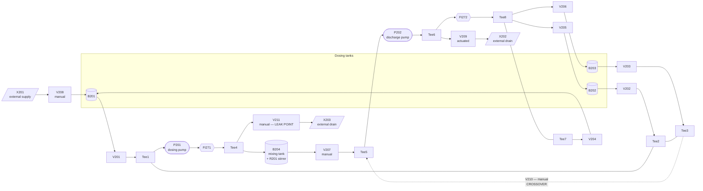

# ModVA plant topology

Reconstructed from three independent sources that agree with each other:

1. **`documents/PID-Diagram.pdf`** — read by rasterising the page (the text is outlined
   vector paths, so text extraction fails, but the drawing renders and is legible).
   This is the authoritative source for the real plant.
2. **`simulation/ModVA_online_stable.mo`** — the `connect(...)` equations give the exact
   fluid graph of the model.
3. **The recorded data** — for each valve, the sign of the level rate in each tank while
   that valve is commanded open, averaged over all 33 normal runs.

Where the three disagree, the disagreement is recorded in
[`benchmark-deviations.md`](benchmark-deviations.md).

---

## 1. Process flow

The plant runs a closed loop: the three dosing tanks drain through V201/V202/V203 into a
common suction manifold, P201 lifts the mixture into B204, P202 empties B204 back around
a return ring, and V204/V205/V206 distribute that return flow back into B201/B202/B203.
V209 dumps to drain instead of recirculating.

## 2. Valve → tank assignment (settled empirically)

Mean level rate per tank while each valve is commanded open, over all 33 normal runs,
ultrasonic LI levels, cm/s:

| Valve | B201 | B202 | B203 | B204 | Role |
| --- | ---: | ---: | ---: | ---: | --- |
| V201 | **−5.79** | 0.00 | 0.01 | +2.72 | drains B201 → B204 |
| V202 | 0.00 | **−5.81** | 0.00 | +2.62 | drains B202 → B204 |
| V203 | 0.00 | 0.00 | **−5.77** | +2.42 | drains B203 → B204 |
| V204 | **+5.41** | 0.00 | 0.00 | −2.25 | fills B201 ← B204 |
| V205 | 0.00 | **+5.38** | 0.00 | −2.40 | fills B202 ← B204 |
| V206 | 0.00 | 0.01 | **+5.19** | −2.44 | fills B203 ← B204 |
| V209 | — | — | — | — | never commanded open in a normal run |

This matches the P&ID (`Pipe_V204_B201`, `Pipe_V205_B202`, `Pipe_V206_B203`) and the
Modelica `connect(...)` equations. It does **not** match some of the Modelica *pipe
component names* — see deviation D3.

## 3. Component inventory

### Vessels

| Tag | Function | Cross-section | Height | Nominal volume |
| --- | --- | --- | --- | --- |
| B201, B202, B203 | Dosing tanks | 0.01431355 m² | 0.22 m | ≈ 3.15 L |
| B204 | Mixing tank | 0.0324 m² | 0.35 m | ≈ 11.34 L |

*(geometry from `ModVA_online_stable.mo`; B204 carries the stirrer R201)*

### Valves

| Tag | Actuation | Type | Position | Controlled by PLC |
| --- | --- | --- | --- | --- |
| V201, V202, V203 | Pneumatic, Festo NVF3-MOH-5/2K-1/4-EX NAMUR pilot | Gate valve | Tank outlets → suction manifold | yes |
| V204, V205, V206 | Pneumatic, Festo NVF3 NAMUR pilot | Festo VZQA-C-M22U pinch valve | Return ring → tank tops | yes |
| V207 | Manual | — | B204 outlet → Tee5 | no |
| V208 | Manual | — | X201 supply → B201 | no |
| V209 | Solenoid, Bürkert Type 6013 | 2/2-way direct-acting | Tee6 → X202 drain | yes |
| V210 | Manual | — | Tee3 ↔ Tee5 crossover | no (PLC has a `V210_auf` prompt output) |
| V211 | Manual | — | Tee4 → X203 drain | no |
| **V212** | Manual | — | Between B204 and P202 | no — clogging rig only, **not drawn in the P&ID** |

V201–V203 (gate valves) and V204–V206 (pinch valves) are all pneumatically actuated through
the Festo NVF3 NAMUR pilot solenoids.

### Pumps and stirrer

| Tag | Function | Type |
| --- | --- | --- |
| P201 | Dosing pump, suction manifold → B204 | Magnetic-drive, seal-less circulating pump (CM10P7-1 / CM30P7-1 family) |
| P202 | Discharge pump, B204 → return ring / drain | same family |
| R201 | Stirrer in B204 | off in nominal operation |

### Instrumentation

| Tag | Measures | Unit | Location in the P&ID |
| --- | --- | --- | --- |
| LI211 – LI214 | Level | cm | Top of B201 … B204, Pepperl+Fuchs UC1000-18GS-IUEP-IO-V15 ultrasonic |
| PI251 – PI254 | Pressure | kPa | PI251–253 on the tank outlet lines; PI254 on `Pipe_B204_V207`. BD Sensors 26.600 G, **0…1 bar** |
| FI271 | Volume flow | l/min | `Pipe_P201_FI271` / `Pipe_FI271_Tee4` — P201 discharge, ifm SM6000, 0.1…25 l/min |
| FI272 | Volume flow | l/min | `Pipe_Tee6_FI272` / `Pipe_FI272_Tee8` — return ring, same type |
| TI261 | Temperature | °C | **on the suction manifold at Tee2**, upstream of P201 — ifm TM4411, Pt100 class A, −40…150 °C |
| TI262 | Temperature | °C | **in B204** |
| LA-201 … LA-204 | Level switch, empty | binary | B201 … B204 |
| LA-205 | Level switch, middle | binary | B204 |
| LA+210/220/230/240 | Level switch, full | binary | B201 … B204 |

> **TI261 / TI262 — the P&ID and the Modelica model are wrong, the data is right.**
> Confirmed by the plant author: **TI261 is at Tee2, TI262 is in B204.** That matches
> `Simulation_Variable_Mapping.xlsx` (`TI261` → `Tempreature_before_Pump_P201`,
> `TI262` → `Temperature_in_B204`) and it matches that table's
> `Simulation_initialization_parameters` column, which pairs TI261 with
> `pipe_V203_Tee2.T_start` and TI262 with `tank_B204.T_start`.
>
> The **P&ID drawing** has the two labels swapped, and the **Modelica model** inherited the
> error: `connect(TI261.port, Pipe_B204_V207.port_a)` puts TI261 on B204, and
> `connect(TI262.port, pipe_V203_Tee2.port_b)` puts TI262 on the suction manifold.
>
> Consequence: the benchmark's simulation post-processing writes simulated temperatures into
> the **wrong columns**. See deviation D4. The recorded data is unaffected — only the P&ID
> drawing and the simulation pipeline need correcting.

### Derived channels

| Channel family | Derived from | Quality |
| --- | --- | --- |
| `Tank_B20x_Volume` | **ultrasonic LI211–214** | good |
| `..._level_calculated_via_LI21x` | ultrasonic LI211–214 | good |
| `..._level_calculated_via_VolumeB20x` | volume, i.e. ultrasonic | good |
| `..._level_calculated_via_PI25x` | pressure PI251–254 | **unreliable** |
| `..._level_calculated_via_PI25x_until_zero_level` | pressure PI251–254 | **unreliable** |

> **The pressure-derived levels are static-pressure only.** They do not account for dynamic
> pressure, so they are wrong whenever fluid is moving past the sensor. Per the plant
> author these channels should not be used. They are carried in the AAS with an explicit
> quality qualifier rather than dropped, so a consumer is told *why* not to use them.

### External connection points

| Tag | Role |
| --- | --- |
| X201 | External supply into B201 through V208 |
| X202 | External drain from Tee6 through V209 |
| X203 | External drain from Tee4 through V211 — the leakage discharge |

## 4. Fault injection points

Every induced fault maps onto a specific place in the topology above:

| Scenario | Injection point |
| --- | --- |
| Leakage | V211 partially open: flow measured by FI271 leaves at X203 instead of reaching B204 |
| Clogging | V212 partially closed (throttle between B204 and P202) |
| Reconfiguration A | V211 discharge routed back into B201 instead of X203 |
| Reconfiguration B | V210 opened: hydrostatic levelling between Tee3 and Tee5 |
| Sensor errors | Objects in front of LI211–LI214 |
| Stirring error | R201 switched on |

## 5. What the Modelica model does not contain

The model covers the nominal loop only. To reproduce the recorded faults it needs the
following additions — see `design/aas-design.md` §5.3:

| Missing | Needed for |
| --- | --- |
| `Tee4` + `V211` + boundary `X203` | Leakage, and reconfiguration A |
| `Tee3`, `Tee5` (the model merges the suction manifold into Tee1/Tee2) | V210 crossover |
| `V210` between Tee3 and Tee5 | Reconfiguration B |
| `V212` between B204 and P202 | Clogging — `V207.opening` is pinned to `1` in the model and sits in exactly that line, so making it a parameter is equivalent |
| **TI261 ↔ TI262 corrected** | The model's temperature sensors are swapped relative to the tags (deviation D4) |
| `V208`, `X201`, `X202` | Completeness only; not needed for the recorded scenarios |
| `R201` | Stirring error — hydraulically absent; its effect is a measurement disturbance |
| Binary level switches `LA*` | Present as `RealToBoolean` blocks but excluded from the result file |
